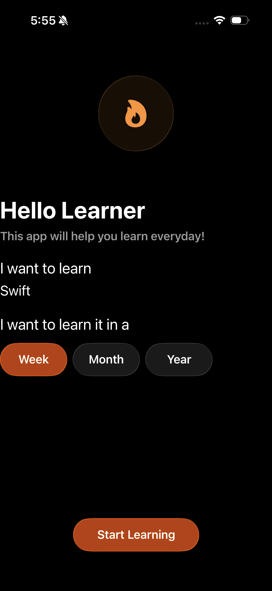
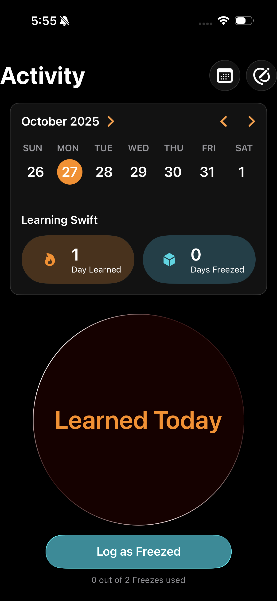
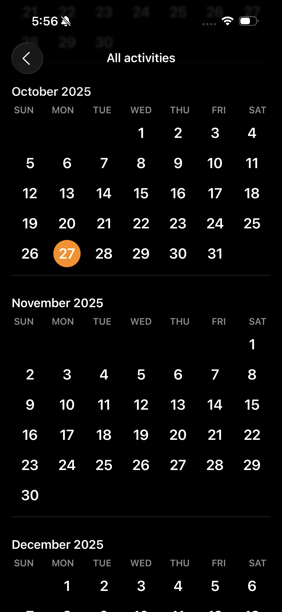

# Learning Journey 

## App Statement
> **Learning Journey** empowers learners to build daily habits around a topic they care about and track their progress in a clear, rewarding way.  
> Using the power of a minimal, focused interface and gamified streak mechanics, it encourages you to show up every day — because small wins add up.  
> Built exclusively for **iOS 26** and designed to embrace Apple’s new **Liquid Glass** design language — where interface elements adopt translucency, softness, and clarity — *Learning Journey* looks modern, polished and fully aligned with the latest Apple software update.

A tiny iOS app that helps you learn **a little every day**.  
Set a topic (e.g. “Swift”), choose a duration (Week / Month / Year), and track your streak.  

  
  
  

---

## Features

- ✍️ **Onboarding** – Type your learning topic and pick a duration.  
- 🔥 **Streaks** – Log “Learned Today”; auto-count your current streak.  
- 🧊 **Freeze days** – Limited “skip” days per goal (2/week, 8/month, 96/year).  
- 📆 **Calendar** – Month list + weekly view; coloured dots for learned/frozen days.  
- ✅ **Goal updates** – Change your goal mid-cycle (option to reset counters).  
- 💾 **Local persistence** – Progress saved to disk; app opens to Activity only after onboarding.

---

## App Architecture (MVVM)

- **Model** – `LearningProgress`  
  Business logic: log/freeze days, streak logic, colors for dates, freeze limits.  
- **ViewModel** – `LearningProgressViewModel`  
  Exposes read-only state to Views; handles actions (`logToday()`, `freezeToday()`); automatically saves.  
- **Views**  
  - `OnboardingView` – Topic + duration input  
  - `ActivityView` – Home screen: toolbar, progress card, action button(s)  
  - `CalendarPageView` – Historical month sections, weekly view  
  - Components: `ToolbarView`, `CalendarProgressView`, `LogActionButton`, `FreezeButton`, `NewGoalButton`, `GoalCompletedView`  
- **Persistence** – `Persistence`  
  Encodes a lightweight `LearningProgressSnapshot` to `UserDefaults` (ISO-8601 dates).  
  **Guard:** App only boots to Activity if a valid topic + duration were saved.

---

## Requirements

- iOS **26+**
- Xcode **26+**
